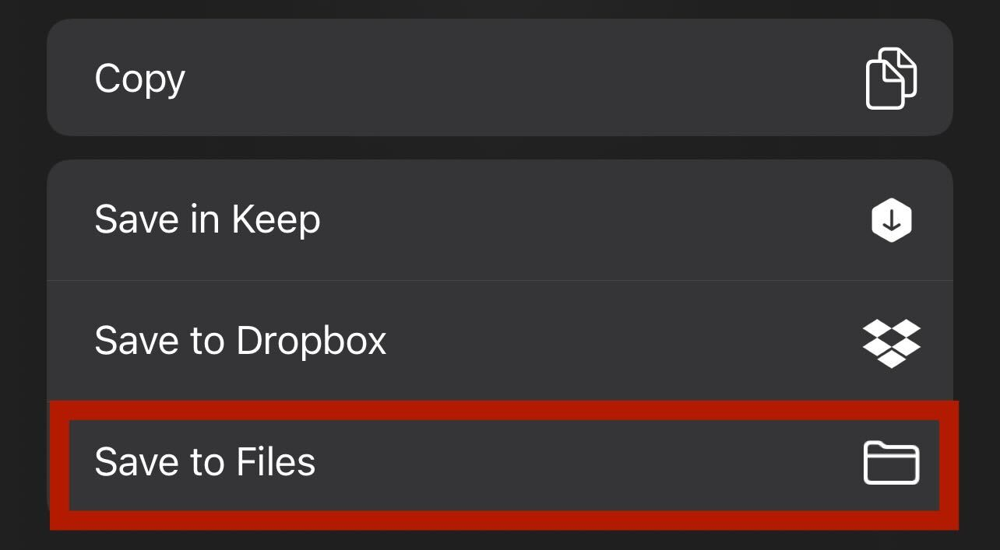
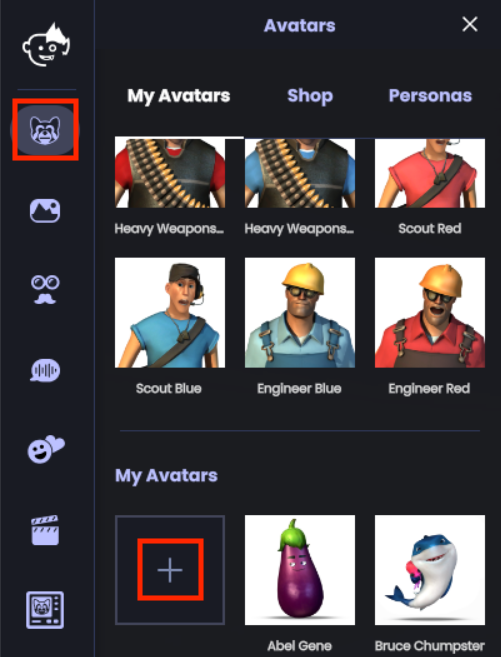

Animaze for iOS is best used to create picture or short video content for Instagram/Tiktok/Youtube Shorts.

Animaze for Windows is best used to livestream to Twitch and Youtube.

# iOS

## Downloads

Download [Animaze](https://apps.apple.com/tr/app/animaze-mobile/id1466925554?ls=1%22) for iOS.

## Importing Your Avatar

Download your avatar while on your phone. Type `/avatar` in the `#vambie-universe` channel to get the download link. Once you’ve tapped the Download button, you’ll see a screen like below:

Tap the “Open In…” option and scroll to the bottom of your screen.

Tap the “Save to Files” option.

Then select “On My iPhone” and find the “Animaze” folder. Save the file in the Animaze folder.

In Animaze, navigate to the “Avatars” tab and then the “Avatars” tab again (that’s right, the “Avatars” tab has another tab also called “Avatars” inside of it) and you will find your Vambie under “Imported Avatars”. If it doesn’t appear, restart Animaze.

## Creating Content

The home screen on iOS Animaze has video recording and photo options. Before you start, tap the ‘Calibrate’ option in the top left of the screen to ensure optimal facial animation.

# Windows PC

## Downloads

Download [Animaze](https://store.steampowered.com/app/1364390/Animaze_by_FaceRig/) from Steam.

## Importing Your Avatar

In Animaze, click the avatar icon to the top left of your screen and scroll down to the “My Avatars” section of the “My Avatars” tab as shown below and click the plus sign:

Navigate to the `.avatar` file you downloaded from Taiyaki Studios and you should be good to go!

## Creating Content

To the right of your avatar will be a preview of what your webcam sees. If you don’t see your face, make sure your webcam is selected from the dropdown.

Before recording, click the calibrate button to ensure optimal facial capture.

If this is your first time livestreaming, click the “Enable Virtual Camera” button in the center-bottom of the screen and follow the “Learn to Stream” tutorial provided by Animaze.

You can also embody your avatar in Zoom calls using [this guide](https://www.animaze.us/manual/appmanual/virtualcam).
