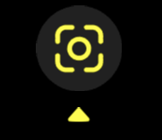

## Downloads

Download Snapchat from:

- [App Store](https://apps.apple.com/us/app/snapchat/id447188370)
- [Google Play](https://play.google.com/store/apps/details?id=com.snapchat.android&hl=en&gl=US)

## Importing Your Avatar

**Using a Lens Link:** Open the link provided on your mobile device.

**Using a Snapcode:**

1. Open Snapchat

2. Point your phone at the Snapcode

3. Press this button at the bottom of your screen:

4. The record button should now have your Vambie’s face in it. Point it at a face to see yourself transform into your Vambie.

5. Tap on the lens name in the upper left of your screen to add it to your favorites. This will allow you to turn it on again by swiping left on the record button the next time you open Snapchat.

## Creating Content

Once the lens is selected, tap on the record button to capture a still, press-hold to record a video.
