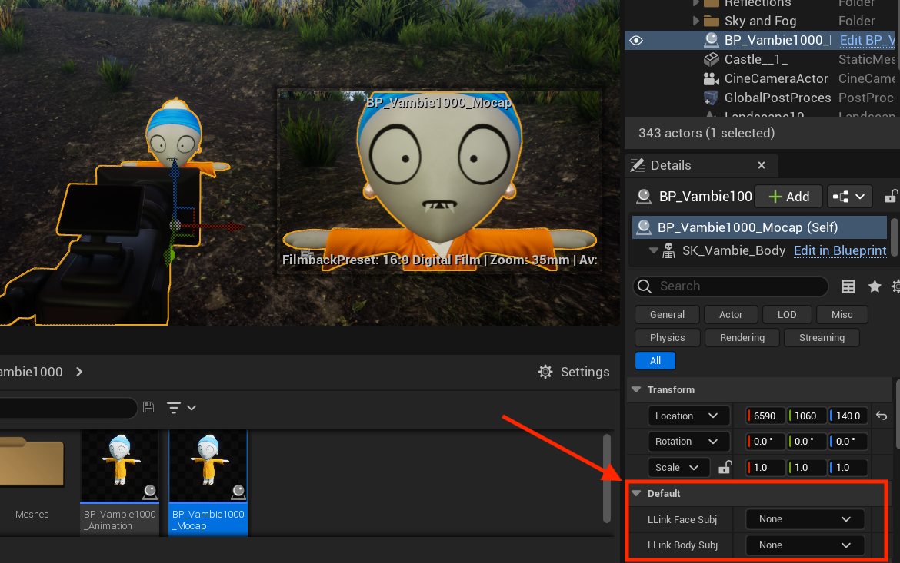

## Downloads

1. Download the [Epic Games Launcher](https://store.epicgames.com/en-US/download).
2. Open the Launcher and Create an Epic Games account.
3. Navigate to the “Unreal Engine” tab and install version 5.0.2.

Here is a video guide:

[https://www.youtube.com/watch?v=rldy9yY0yDU](https://www.youtube.com/watch?v=rldy9yY0yDU)

## Importing Your Avatar

Navigate to the `ueproject/VambieUEProject` folder you downloaded and open the `.ueproject` file. This will open the environment we’ve provided for you to create Vambie content in.

To add new vambies to the level, navigate to `ueproject/VambieUEProject/Content/` folder in explorer. NOTE: this will not work inside the Unreal Engine content browser. You have to navigate to the folder in explorer.

In explorer, also find the Vambie folder you have downloaded. Drag the entire Vambie folder into `ueproject/VambieUEProject/Content/`.

The Vambie should now appear in the Unreal content browser.

## Creating Content

**Using body mocap & facial animation:** Drag the `BP_Vambie_Mocap` asset from the content drawer into your scene.

**Using pre-made animations & facial animation:** Drag the `BP_Vambie_Animation` asset from the content drawer into your scene.

We have set up these blueprints with shortcuts for facial & body mocap:

Once your iPhone is streaming facial data using LiveLink Face, your phone will appear in the LLink Face Subj dropdown.

Once your motion capture suit is streaming body data, your suit will appear in the LLink Body Subj. If you don’t see it there, navigate to Window > Virtual Production > Live Link and in the window that appears, make sure you have added your motion capture suit as a source. Refer to your suit’s manufacturer for a guide on how to stream mocap data to Unreal.
