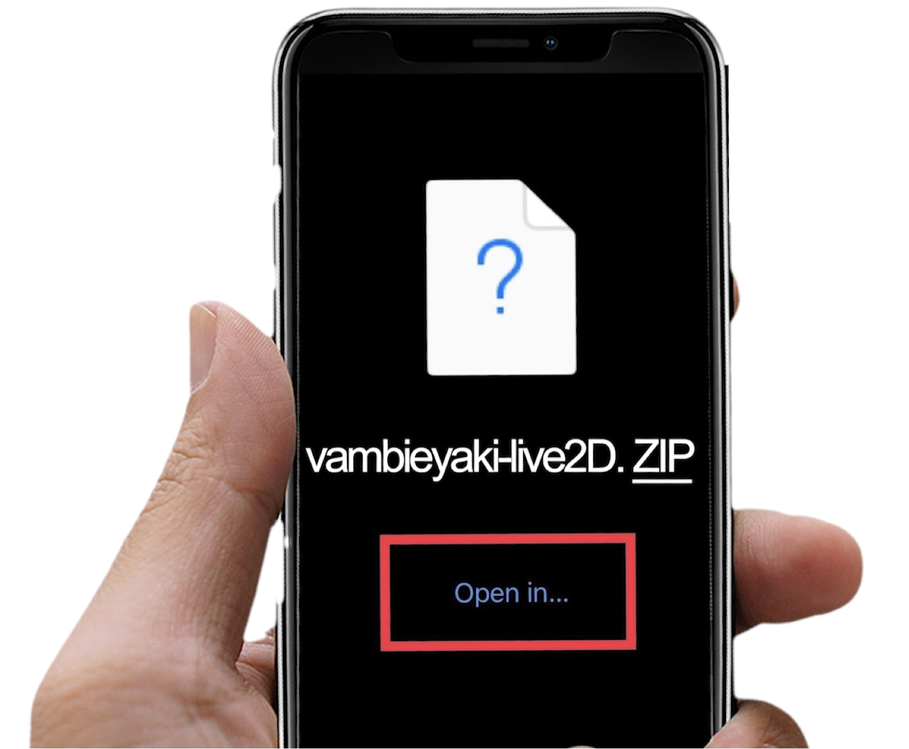

LIVE2D avatars can be operated via VTube studio, either on a Windows computer or on iOS.

## PC Vambie Installation

VTube Studio can be downloaded for free from Steam.

- Download Steam: [https://store.steampowered.com/about/](https://store.steampowered.com/about/)
- Download VTube Studio: [VTube Studio on Steam](https://store.steampowered.com/app/1325860/VTube_Studio/)

To get started, unzip your Vambie folder downloaded from the Taiyaki Avatar Selection page. The unzipped folder should look like this:

Then, open Vtube Studio and click the Avatar icon in the top left:

A panel will appear along the bottom of the screen with a list of default avatars available to select. The first icon says, ‘import your own model’. Click on this icon. A pop up will appear with a link to open a folder. Select this option:

Once the ‘Live2DModels’ folder is open, paste in the folder for the Vambie Avatar that you downloaded from the Taiyaki Avatar Selection page. Make sure that the downloaded file has been unzipped.

Restart Vtube studio. Once again select the top Avatar icon. This time when the panel appears, you should see your avatar available for selection. Select it and enjoy.

## iOS Vambie Installation

Download VTube Studio from the App Store: [‎VTube Studio on the App Store](https://apps.apple.com/us/app/vtube-studio/id1511435444)

When the app has been installed, download your Avatar while on your phone.

Once you have made your selection and download the avatar on your phone you will see a pop up like the image below:

Tap ‘Open in’ and then select ‘Save to files’. In ‘on My iPhone’, find the folder for Vtube studio. Open it and find the folder called Live2DModels. Select this folder to save your ZIP file in.

Once this has been done, you will then need to return to files on your iPhone:

Navigate your way to the Vtubestudio folder, and then to the Live2DModels folder inside of it. This is where you saved your zip file. When you locate your saved file, hold your finger on it until a pop up appears:

Select ‘Uncompress’ to unzip your file. When this has been done, open the VTube Studio app.

Select the pink avatar icon to the left top of the screen. When you tap this icon, a list of characters will appear at the bottom. Scroll along and you should see your downloaded avatar from Taiyaki. Select and enjoy.
